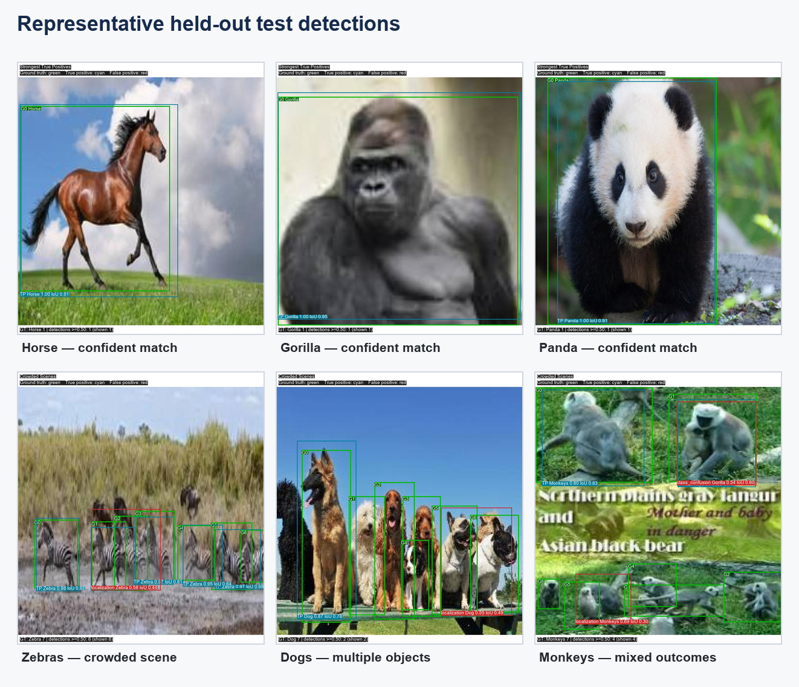
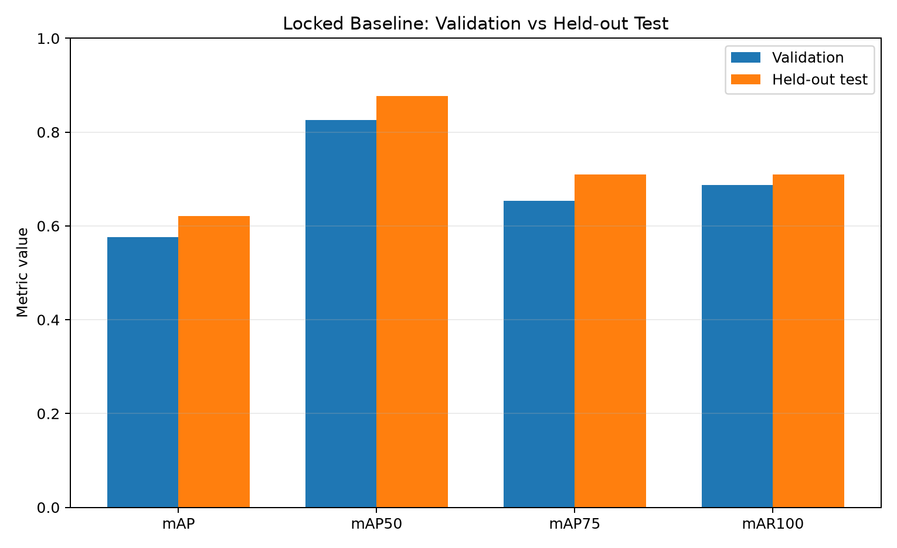
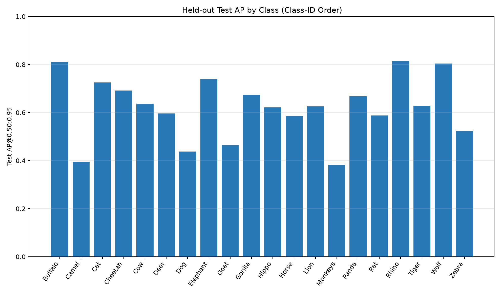
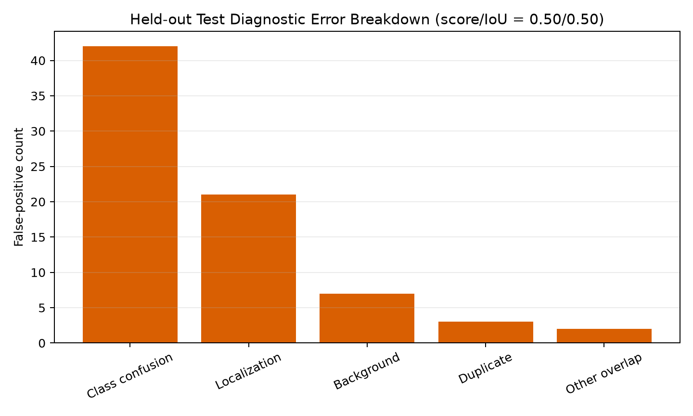
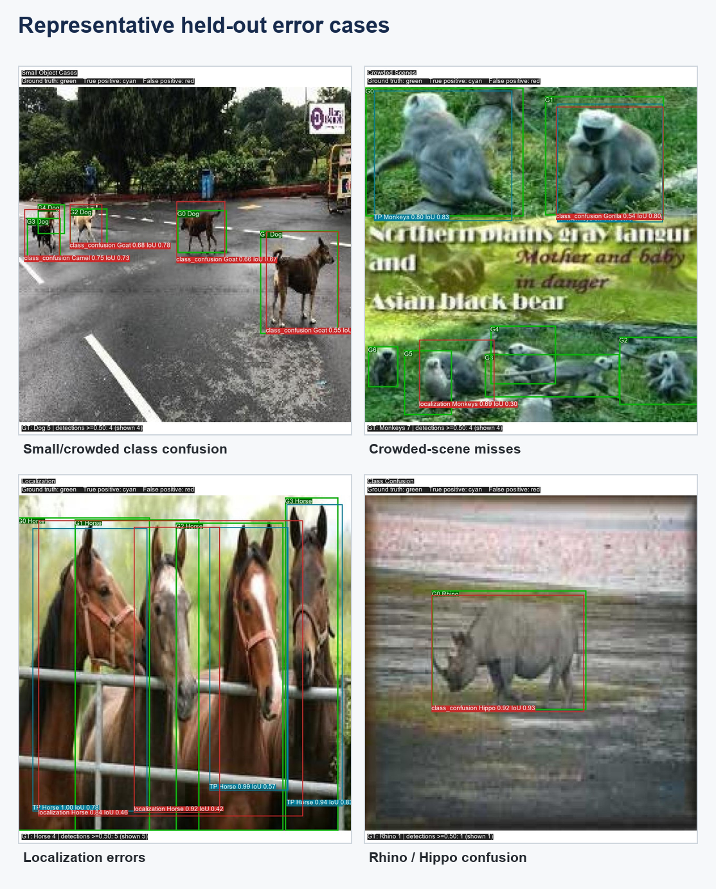
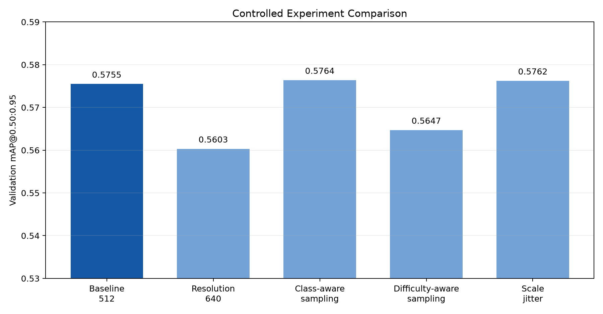
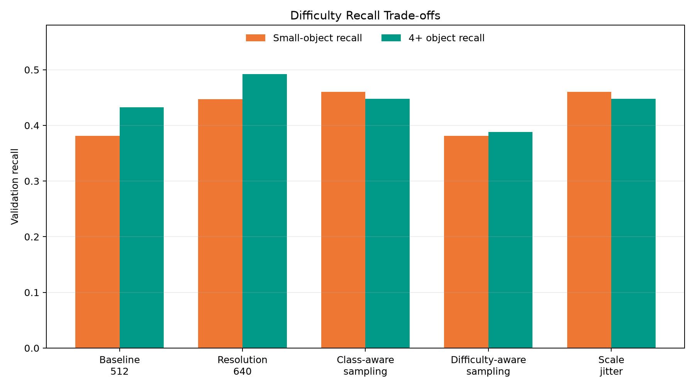
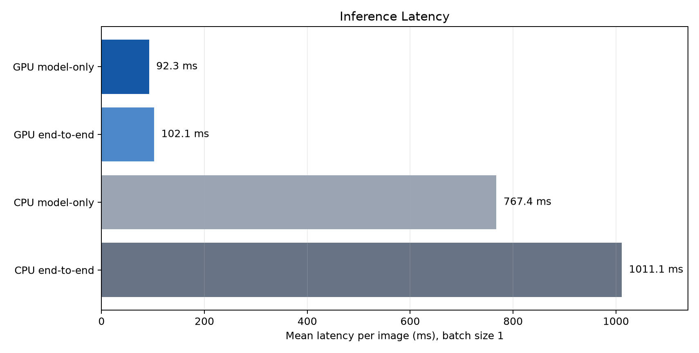

# Multi-Class Animal Detection with Faster R-CNN

An end-to-end PyTorch object-detection project spanning audited data, Faster R-CNN fine-tuning, controlled experiments, held-out evaluation, and inference benchmarking.

**Selected model:** Faster R-CNN ResNet50-FPN with COCO V1 pretrained weights

**Selection rule:** validation mAP@0.50:0.95, locked before test evaluation

| Final held-out test | Result |
|---|---:|
| mAP@0.50:0.95 | **0.6207** |
| mAP@0.50 | **0.8775** |
| mAP@0.75 | **0.7092** |
| mAR@100 | **0.7092** |
| Precision @ score/IoU 0.50/0.50 | **0.8072** |
| Recall @ score/IoU 0.50/0.50 | **0.8093** |

**20 classes · 300 held-out test images · RTX 3050 benchmark · 10.8 model-only images/s**



*Ground truth is green, matched predictions are cyan, and retained errors are red. These examples come from the frozen final-test prediction cache; no inference was rerun for this montage.*

## Project Overview

The goal is to detect and classify 20 animal categories in natural and curated imagery. The engineering focus is evidence-driven model development: a validated data layer, one-variable experiments, explicit failure analysis, validation-only model selection, one locked held-out evaluation, and practical latency measurement.

Several alternatives improved targeted metrics, but the original 512×512 baseline remained the best-balanced detector once aggregate AP, localization, class balance, compute, and error behavior were considered together.

## Dataset

### Dataset source

This project uses the [Multi-Class Animal Detection dataset on Kaggle](https://www.kaggle.com/datasets/notaashman/multiclass-animal-detection).

The raw dataset is intentionally not included in this repository. Download it from Kaggle and extract it into the repository root as:

```text
Multi-Class Animal Detection.v1-yolov8/
```

| Split | Raw images | Used | Annotated objects | Role |
|---|---:|---:|---:|---|
| Train | 1,400 | 1,399 | 1,889 | Optimization |
| Validation | 300 | 299 | 412 | Model selection and diagnostics |
| Test | 300 | 300 | 388 | One-time final evaluation |
| **Total** | **2,000** | — | **2,689** | **20 animal classes** |

Annotations use normalized YOLO `class_id cx cy width height` rows. A custom PyTorch `Dataset` converts boxes to pixel `xyxy`, validates coordinates and labels, supports variable-length targets, and works with paired image/target transforms and a detection-specific collate function.

The audit found two empty label files whose images visibly contain animals. Their annotations were never edited: the affected training and validation samples are handled through [`data/manifests/excluded_samples.json`](data/manifests/excluded_samples.json). Raw data remains immutable and Git-ignored.

Detailed evidence: [dataset audit](reports/dataset_audit.json), [dataset tree](reports/dataset_tree.txt), and [annotation samples](reports/sample_annotations.txt).

## Detection Architecture

```text
Input image
    ↓
ResNet-50 backbone
    ↓
Feature Pyramid Network (multi-scale features)
    ↓
Region Proposal Network (candidate objects)
    ↓
RoI Align (fixed-size proposal features)
    ↓
Classification head + box-regression head
    ↓
Non-maximum suppression
    ↓
Final boxes, classes, and confidence scores
```

The backbone extracts visual features; the FPN exposes them at several spatial scales. The RPN proposes likely object regions, RoI Align creates consistent proposal features, and the final heads jointly classify each region and refine its box. The task-specific predictor has 21 outputs: background plus 20 foreground classes.

## Training Pipeline

```text
YOLO annotations
      ↓
Custom detection Dataset
      ↓
Annotation + target validation
      ↓
Paired image/box transforms
      ↓
DataLoader + detection collate
      ↓
Faster R-CNN forward pass
      ↓
Four-loss optimization
      ↓
COCO-style validation mAP
```

Baseline training uses 512×512 inputs, batch size 1, 10 epochs, FP32, seed 42, and all 41,396,536 parameters trainable. SGD uses LR 0.0025, momentum 0.9, weight decay 0.0005, and `StepLR(step_size=7, gamma=0.1)`. Training applies resize plus horizontal flip (`p=0.5`); validation applies deterministic resize only.

Faster R-CNN optimizes four complementary losses:

- **Classifier:** predicts the foreground class or background for each proposal.
- **Box regression:** refines final object-box coordinates.
- **Objectness:** teaches the RPN which anchors likely contain objects.
- **RPN box regression:** refines proposals before RoI processing.

## Final Results

The baseline checkpoint from epoch 9 was selected using validation mAP before the test split was constructed. The model, preprocessing, checkpoint, and diagnostic thresholds were not changed after observing test results.

| Metric | Validation | Held-out test | Test − validation |
|---|---:|---:|---:|
| mAP@0.50:0.95 | 0.5755 | **0.6207** | +0.0452 |
| mAP@0.50 | 0.8257 | **0.8775** | +0.0518 |
| mAP@0.75 | 0.6530 | **0.7092** | +0.0562 |
| mAR@100 | 0.6874 | **0.7092** | +0.0218 |



Aggregate test metrics exceeded validation metrics. This is descriptive, not a statistical-significance claim, and it did not trigger further model selection or tuning.

### Per-class performance



| Group | Class | Test AP@0.50:0.95 |
|---|---|---:|
| Strongest | Rhino | 0.8149 |
| Strongest | Buffalo | 0.8118 |
| Strongest | Wolf | 0.8036 |
| Weakest | Monkeys | 0.3820 |
| Weakest | Camel | 0.3951 |
| Weakest | Dog | 0.4378 |

Class-level variation remains meaningful despite the strong aggregate result. Full class-ID-ordered metrics are available in [`per_class_test_metrics.csv`](reports/final_evaluation/per_class_test_metrics.csv).

## Where the Detector Still Struggles

Diagnostics use thresholds fixed during validation: score ≥ 0.50 and IoU ≥ 0.50. They describe one operating point and do not replace COCO AP.

| Object size | Recall | Scene density | Recall |
|---|---:|---|---:|
| Small | **43.1%** | 1 object | **87.1%** |
| Medium | 88.1% | 2–3 objects | 80.2% |
| Large | 88.8% | 4+ objects | **50.0%** |

| Diagnostic outcome | Count |
|---|---:|
| True positives | 314 |
| False positives | 75 |
| False negatives | 74 |
| Class-confusion FP | 42 |
| Localization FP | 21 |
| Background FP | 7 |
| Duplicate FP | 3 |
| Other overlap | 2 |



Small objects remain substantially harder than medium and large objects, and recall falls in scenes with four or more annotations. Class confusion is the largest false-positive source; localization is secondary. Matched detections are generally well aligned (mean IoU 0.8498, median 0.8745), while confidence separates TP and FP imperfectly: median confidence is 0.975 for TP and 0.663 for FP.



*Representative cases connect the aggregate error counts to small/crowded misses, box-localization errors, and semantic confusion.*

Full diagnostics and exact example paths are under [`reports/final_evaluation/error_analysis/`](reports/final_evaluation/error_analysis/).

## Controlled Experiments

Each experiment changed one primary variable while retaining the architecture, pretrained weights, optimizer, schedule, seed, exclusions, and validation discipline.

| Experiment | Changed variable | mAP | mAP75 | Small recall | 4+ recall | Decision |
|---|---|---:|---:|---:|---:|---|
| Baseline 01 | Standard 512 training | 0.5755 | **0.6530** | 0.3816 | 0.4328 | **Selected** |
| Experiment 02 | 640 resolution | 0.5603 | 0.6305 | 0.4474 | **0.4925** | Not selected |
| Experiment 03 | Class-aware sampling | **0.5764** | 0.6446 | **0.4605** | 0.4478 | Not selected |
| Experiment 04 | Difficulty-aware sampling | 0.5647 | 0.6282 | 0.3816 | 0.3881 | Not selected |
| Experiment 05 | Scale jitter | 0.5762 | 0.6212 | **0.4605** | 0.4478 | Not selected |





*The alternatives moved targeted recall in different directions, but none offered a better overall balance than the selected baseline.*

- **640 resolution** improved difficult-case recall but reduced overall AP and increased runtime and memory.
- **Class-aware sampling** helped Camel and Goat and improved recall, but weakened strong-class balance.
- **Difficulty-aware sampling** showed that repeated exposure to difficult images alone did not solve the difficult validation cases.
- **Scale jitter** improved small/crowded recall, but localization-sensitive AP and precision declined.

The original 512 baseline remained the best-balanced detector. The alternatives not selected are useful hypothesis tests: they expose trade-offs and prevent model selection from becoming a search for any isolated metric gain.

Experiment details: [baseline](reports/experiments/faster_rcnn_baseline_01/summary.json), [640 comparison](reports/experiments/faster_rcnn_resolution_640_01/comparison_vs_baseline_01.txt), [class-aware comparison](reports/experiments/faster_rcnn_class_aware_sampling_01/comparison_vs_baseline_01.txt), [difficulty-aware comparison](reports/experiments/faster_rcnn_difficulty_aware_sampling_01/comparison_vs_baseline_01.txt), and [scale-jitter comparison](reports/experiments/faster_rcnn_scale_jitter_01/comparison_vs_baseline_01.txt).

## Inference Benchmark

Batch-1 inference was measured using the selected checkpoint at 512×512. Model loading is excluded; CUDA timings are synchronized. GPU measurements use an NVIDIA GeForce RTX 3050 4GB Laptop GPU.

| Device / pipeline | Mean latency | Median | p95 | Throughput |
|---|---:|---:|---:|---:|
| GPU model-only | **92.339 ms** | 92.065 ms | 95.730 ms | **10.830 img/s** |
| GPU end-to-end | 102.101 ms | 102.176 ms | 106.273 ms | 9.794 img/s |
| CPU model-only | 767.436 ms | 755.776 ms | 891.436 ms | 1.303 img/s |
| CPU end-to-end | 1011.148 ms | 972.485 ms | 1275.954 ms | 0.989 img/s |



The synchronized GPU model-only benchmark used 20 warmup and 100 timed iterations. Peak model-only CUDA memory was 321.733 MiB allocated and 470 MiB reserved; end-to-end peak memory was 324.608 MiB allocated and 572 MiB reserved. Full methodology is in the [GPU](reports/final_evaluation/benchmark_cuda.txt) and [CPU](reports/final_evaluation/benchmark_cpu.txt) reports.

## Engineering and Evaluation Discipline

- Raw images and annotations are immutable and excluded from version control.
- YOLO parsing, box geometry, target shapes, dtypes, and label ranges are validated explicitly.
- Dataset IDs `0..19` map explicitly to torchvision foreground IDs `1..20`; background remains `0`.
- Paired transforms update images, boxes, labels, area, and size metadata together.
- Split handling, exclusions, sampling, and augmentation simulations are deterministic under seed 42.
- Experiments record configuration, history, metrics, diagnostics, plots, and integrity hashes.
- Checkpoint selection uses validation only; the test set was evaluated once after a written selection lock.
- Before/after hashes confirm the raw dataset, test data, checkpoint, and exclusion manifest were unchanged.
- The final full test suite contains 75 passing tests.

See the [selection lock](reports/final_evaluation/model_selection_lock.txt), [integrity report](reports/final_evaluation/integrity.json), [verification report](reports/final_evaluation/verification.txt), and [final summary](reports/final_evaluation/final_summary.txt).

## Project Structure

```text
animal-detection/
├── data/
│   └── manifests/              # reviewed exclusions
├── src/animal_detection/
│   ├── data/                   # datasets, adapters, transforms, validation
│   ├── models/                 # Faster R-CNN construction
│   ├── engine/                 # training and COCO-style evaluation
│   ├── analysis/               # matching, diagnostics, visualizations
│   └── utils/                  # shared utilities
├── scripts/                    # audits, training, analysis, benchmarks
├── reports/
│   ├── experiments/            # baseline and controlled experiments
│   ├── final_evaluation/       # locked held-out results
│   └── readme/                 # README presentation assets
├── tests/
├── README.md
└── requirements.txt
```

## Reproduction

### Environment

```powershell
conda create -n animal-detection python=3.12 -y
conda activate animal-detection
python -m pip install -r requirements.txt --extra-index-url https://download.pytorch.org/whl/cu130
python -m pip install -r requirements-dev.txt --extra-index-url https://download.pytorch.org/whl/cu130
```

The dataset is expected at the repository-relative directory `Multi-Class Animal Detection.v1-yolov8/`.

### Audit the immutable dataset

```powershell
python scripts/inspect_dataset.py --dataset-root "Multi-Class Animal Detection.v1-yolov8"
```

### Train the selected baseline configuration

```powershell
python scripts/train_faster_rcnn.py `
  --dataset-root "Multi-Class Animal Detection.v1-yolov8" `
  --experiment-name faster_rcnn_baseline_01 `
  --image-size 512 --epochs 10 --batch-size 1 `
  --lr 0.0025 --momentum 0.9 --weight-decay 0.0005 `
  --step-size 7 --gamma 0.1 --seed 42
```

### Analyze validation errors

```powershell
python scripts/analyze_validation_errors.py `
  --experiment-dir reports/experiments/faster_rcnn_baseline_01 `
  --checkpoint checkpoints/faster_rcnn_baseline_01/best.pt `
  --score-threshold 0.50 --iou-threshold 0.50 --device cuda
```

### Final held-out evaluation

> **Methodology warning:** `scripts/evaluate_final_test.py` accesses the held-out test split. It must not be run during model development, checkpoint selection, threshold selection, or experiment tuning. In this project it was run only after the model-selection lock was written, and it intentionally refuses to overwrite the existing final prediction cache.

For a fresh end-to-end reproduction after locking selection:

```powershell
python scripts/evaluate_final_test.py `
  --checkpoint checkpoints/faster_rcnn_baseline_01/best.pt `
  --dataset-root "Multi-Class Animal Detection.v1-yolov8" `
  --device cuda
```

### Benchmark inference and verify tests

```powershell
python scripts/benchmark_inference.py `
  --checkpoint checkpoints/faster_rcnn_baseline_01/best.pt `
  --dataset-root "Multi-Class Animal Detection.v1-yolov8" `
  --split test --device cuda --warmup 20 --iterations 100 `
  --output-dir reports/final_evaluation

pytest -q
```

## Key Lessons and Limitations

- Aggregate AP alone is insufficient: localization, class balance, scene density, latency, and memory changed the selection decision.
- Small-object recall (43.1%) and crowded-scene recall (50.0%) remain the clearest technical limitations.
- More pixels or more exposure to selected samples did not automatically produce a better-balanced detector.
- Scale variation helped targeted recall but exposed a localization trade-off.
- The dataset is modest, and no confidence intervals or repeated-seed study were performed; validation/test differences should be interpreted descriptively.

The complete evidence trail remains under [`reports/`](reports/), while this README focuses on the decisions, results, and engineering practices most useful to reviewers.
